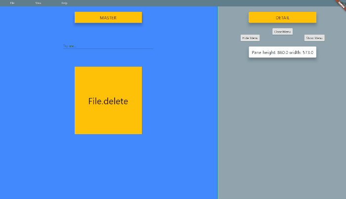

# flutter_menu

This packages is developed for web but should work in flutter desktop as well (is tested on Flutter Windows). 

The package gives you a desktop like experience on web. It gives you the following:

- [x] Menu with list items (with icon, title and keyboard shortcuts)
- [x] Keyboard shortcuts for menu items
- [x] Master, detail views (Left pane, right pane)
- [ ] Flexible pane sized for user to change in ui
- [ ] Context menu (right click) for screen and widgets
- [ ] More panes (drawer, maybe a 4th pane)
- [ ] Extra topbar to be used as toolbar or information bar
- [ ] Fullscreen dialogs
- [ ] different menu in compact mode
- [ ] Two different menulayouts: desktop or tablet

All siblings down the widget tree has access to the AppScreen functionality.
 
This is a beta release and breaking changes will come soon!

Try it out: http://www.flutter.psychtech.mitspace.dk/





## How to install

### On web:

The Flutter App has to have control over the right click (contextmenu).
To take control you have to include the following in your index.html file in the web folder:

```
<body oncontextmenu="return false;"></body>
```

### On desktop:

Nothing has to be changed.


## How to use

You can access all variables and functions through the buildContext, and for your convenience we have made an extention for easy access: context.appScreen

the AppScreen has to be in a parent BuildContext (and not the current context). This is why panes has to be a Builder function and not just a Widget. To prevent you from making misconceptional errors.

### Menus

The menu can have several menuItems and each menuItem has its own menuListItems.

Each menuItem decides width and height of the menuItemList widget and can be set as active or not.

MenuListItem can be a MenuListDivider() or a MenuListItem.

MenuListItems can have icons, shortcuts and have a callback function: onPressed().

See example.

Programmably you can control:

*context.appScreen.hideMenu()* - hides the menu from the screen. Keyboard shortcuts is still active
*context.appScreen.showMenu()* - shows the menu on the screen
*context.appScreen.openMenu()* - opens the active menuitem
*context.appScreen.closeMenu()* - close a open menuitem (if any)

You have access to current variables:

*context.appScreen.isMenuShown()* - returns true if menu is shown on Screen
*context.appScreen.isMenuOpen()* - returns true if a MenuItem is shown on Screen


### Keyboard shortcuts

It is possible to activate functions with keyboard shortcuts which is good for productibility.

Each MenListItem() can be supplied with a MenuShortcut().

*MenuShortcut.key* is of type LogicalKeyboardKey and is defined in flutter/services.dart. This should be a normal physical key. 

You can then choose which system keys has to be hold down as well: ctrl, alt, shift.
Please notice that shift should only be used in combination with other system keys and notice that the browser takes presidence over the app for keyboard shortcuts - so choose with care.


### Keyboard Shortcut Overlay

Overlay feature is disabled by default, but can be enabled programmably (se How-to-use section). This can be helpfull under development and as a feature making example videos.

context.appScreen.showShortcutOverlay()  - 2 sec. text overlay will be shown
context.appScreen.hideShortcutOverlay()  - No overlay will be shown

### Master/ detail panes

You always have to set the Master pane. If no detail pane is supplied only Master is shown.
If you set both Master and detail panes default behavior will be give the user control of a moveable vertical line in the UI to change the size of the detail pane.

In AppScreen() you can set:

*detailFixedWidth (default=false)* if true detailPane width is fixed to *detailWidth*
*detailWidth* this is the start value (and permanent value if detailFixedWidth==true)
*detailMinWidth* Minium width
*detailMaxWidth* Maximum width

The Master/detail panes are responsive, and you can set the breakpoint:

*desktopBreakpoint (=800)* if screen width is under breakpoint value the compact view is shown
*onBreakPointChange* A callback function to update your UI on change (it is automatically delayed to next tick to prevent call under UI build).

You have access to current variables:

*context.appScreen.isDesktop()* - returns true if Desktop and false if compact
*context.appScreen.detailIsShown()* - returns true if detail is shown

In compact mode you can change master/detail view:

*context.appScreen.showOnlyMaster()*  change UI to show masterPane()
*context.appScreen.showOnlyDetail()* change UI to show detailPane() 


