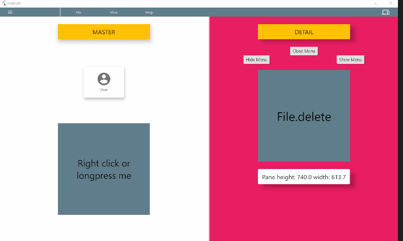

# flutter_menu

This is a responsive UI framework developed for Web and Desktop. 

Try it out: http://www.flutter.psychtech.mitspace.dk/

The package gives you a desktop like experience on web (responsive to touch and desktop displays). It gives you the following:



- [x] Menu with list items (with icon, title and keyboard shortcuts)
- [x] Keyboard shortcuts for menu items
- [x] Master, detail views (Left pane, right pane)
- [x] Pane sizes can be changed by user (or not - you choose).
- [x] Context menu (right click) for Master, Detail and widgets
- [x] Longpress for contextmenu (for touch displays). Centered and animated
- [x] Choose between touch UI or desktop UI (can be change by user)
- [x] Drawer (small or large)
- [x] Pane sizes is set by a flex factor for the UI to stay nice and responsive.


- [ ] different menu in compact mode (to be responsive)
- [ ] More predefined contextmenus to choose from
- [ ] Scrollbar
- [ ] More callbacks on change
- [ ] Extra topbar to be used as toolbar or information bar
- [ ] Fullscreen dialogs

All siblings down the widget tree has access to the AppScreen functionality.
 
This is a beta release and breaking changes will come soon!

Get support, announcements and share knowledge: https://discord.gg/pmXCFZUxxC

## How to install

### On web:

The Flutter App has to have control over the right click (contextmenu).
To take control you have to include the following in your index.html file in the web folder:

```html
<body oncontextmenu="return false;"></body>
```

### On desktop:

Nothing has to be changed.


## How to use

You can access all variables and functions through the buildContext, and for your convenience we have made an extention for easy access:

```dart
context.appScreen
```

the AppScreen has to be in a parent BuildContext (and not the current context). This is why panes has to be a Builder function and not just a Widget. To prevent you from making misconceptional errors.

## Menus

The menu can have several menuItems and each menuItem has its own menuListItems.

Each menuItem decides width and height of the menuItemList widget and can be set as active or not.

MenuListItem can be a MenuListDivider() or a MenuListItem.

MenuListItems can have icons, shortcuts and have a callback function: onPressed().

See example.

Programmably you can control:

```dart
context.appScreen.hideMenu(); // hides the menu from the screen. Keyboard shortcuts is still active
context.appScreen.showMenu(); // shows the menu on the screen
context.appScreen.openMenu(); // opens the active menuitem
context.appScreen.closeMenu(); // close a open menuitem (if any)
```


You have access to current variables:

```dart
context.appScreen.isMenuShown(); // returns true if menu is shown on Screen
context.appScreen.isMenuOpen();  // returns true if a MenuItem is shown on Screen
```


## Keyboard shortcuts

It is possible to activate functions with keyboard shortcuts which is good for productibility.

Each MenListItem() can be supplied with a MenuShortcut().

*MenuShortcut.key* is of type LogicalKeyboardKey and is defined in flutter/services.dart. This should be a normal physical key. 

You can then choose which system keys has to be hold down as well: ctrl, alt, shift.
Please notice that shift should only be used in combination with other system keys and notice that the browser takes presidence over the app for keyboard shortcuts - so choose with care.


## Keyboard Shortcut Overlay

Overlay feature is disabled by default, but can be enabled programmably (se How-to-use section). This can be helpfull under development and as a feature making example videos.

```dart
context.appScreen.showShortcutOverlay();  // 2 sec. text overlay will be shown
context.appScreen.hideShortcutOverlay();  // No overlay will be shown
```


## Master/ detail panes

You always have to set the Master pane. If no detail pane is supplied only Master is shown.
If you set both Master and detail panes default behavior will be give the user control of a moveable vertical line in the UI to change the size of the detail pane.

In AppScreen() you can set:

```dart
  final double masterPaneFlex;      // default=1
  final double detailPaneFlex;      // default=1
  final double masterPaneMinWidth;  // default= 500
  final double detailPaneMinWidth;  // default = 500
```

The flex sizing is just as in the Expanded() widget. You set the relative size, as for the UI to stay responsive when window size changes. The UI updates with respect for the minimum sizes, and if the detailPane can not stay on screen, only master will be shown.

The user can change the sizes of the master and detail panes, if this is possible within the minium size boundaries.


The Master/detail panes are responsive, and you can set the breakpoint:

*desktopBreakpoint (=800)* if screen width is under breakpoint value the compact view is shown
*onBreakPointChange* A callback function to update your UI on change (it is automatically delayed to next tick to prevent call under UI build).

You have access to current variables:

*context.appScreen.isDesktop()* - returns true if Desktop and false if compact
*context.appScreen.detailIsShown()* - returns true if detail is shown

You can get the screen and pane sizes and topleft and bottomright corner position:

```dart
context.appScreen.screenDetails
context.masterPaneDetails
context.master
```
```dart
class Detail {
  double height;
  double width;
  double minDx;
  double minDy;
  double maxDx;
  double maxDy;
}
```

In compact mode you can change master/detail view:

```dart
context.appScreen.showOnlyMaster(); //  change UI to show masterPane()
context.appScreen.showOnlyDetail(); // change UI to show detailPane() 
```

## Drawer

The AppScreen has its own drawer, just as the Scaffold() has.

You can choose set only one size of drawer or you can have to different sizes for the user to choose.

```dart
class AppDrawer {
  final double smallDrawerWidth;
  final Widget smallDrawer;
  final double largeDrawerWidth;
  final Widget largeDrawer;
  final bool showOnDesktop;
  final bool defaultSmall;
  final bool autoSizing;            // autoSizing is not yet implemented.
  final double edgeDragOpenWidth;
}
```
*default small* if true Drawer opens with the small drawer on start.

*showOnDesktop* if true Drawer will be shown automaticly on Desktop is AppScreen is big enough.

*edgeDragOpenWith* is for touch users to slide the drawer open. It indicates the zone where dragging is registred. On mobile devices it is set to 20 in the Drawer() of Scaffold(). But in browsers run on mobile devices there can be a sliding function the change webpage. The zone has been made bigger to adjust for this. You might change it according to your needs. If set to 0 drag to Open Drawer will be disabled.

## Context menu (right click or longpress)

You can set different context menus for Master & Detail pane, and each individual Widget can have its own context menu.

If contextmenu is activated by a longpress it will be centered and animated. If it is right clicked it will be top left position and no animation.

```dart
AppScreen(
  masterContextMenu: ContextMenu(
    width: 150,
    height: 250,
    child: ContextMenuSliver(
      title: 'Master',
      children: [
        masterContextMenuItem(color: 'Red'),
        masterContextMenuItem(color: 'Blue'),
        masterContextMenuItem(color: 'Purple'),
        masterContextMenuItem(color: 'Pink'),
      ],
    ),
  ),
)
```
This gives us a ContextMenu as shown in the masterPane (it stays within boundaries of the Master Pane).


You just wrap a widget in a ContextMenu() widget and specify the widget. You can use the prebuild ContextMenuSliver() or build your own. 

The only requirement is that the ContextMenu() is a sibling to AppScreen(). 

```dart
ContextMenuContainer(
    menu: ContextMenuSliver(title: 'Widget'),
    menuWidth: 200,
    menuHeight: 200,
    child: SizedBox(height: 200, width: 200),
)
```

This will give you a small empty ContextMenu. You can use ContextMenuSliverItem to build your menu.

Please take a look at the example app for more examples.

More prebuild ContextMenus will come. Feel free to build your own and contribute to the project.

